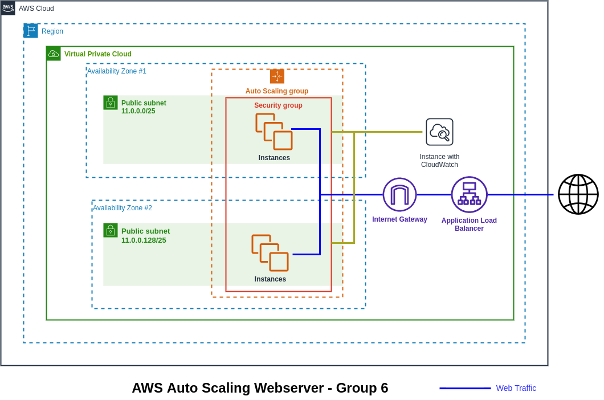
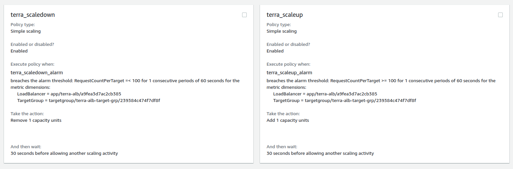
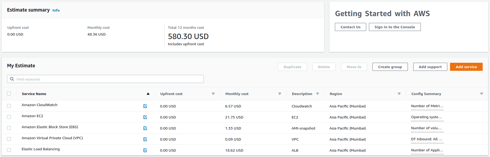

# Auto Scaling Webserver using Terraform

* On the basis of load (web traffic) increase or decrease EC2 instance to avoid unavailability of website.

* Used customized AMI with a Apache2 web server deployed on it. 

* EC2 Autoscaling groups with scale-in & scale-out policies for scaling purpose.

* Load Balancer to route traffic to the EC2 instances. 

### Technologies 

> 
> 

### Architecture

### Scaling Policies

### Cost Estimation

###

